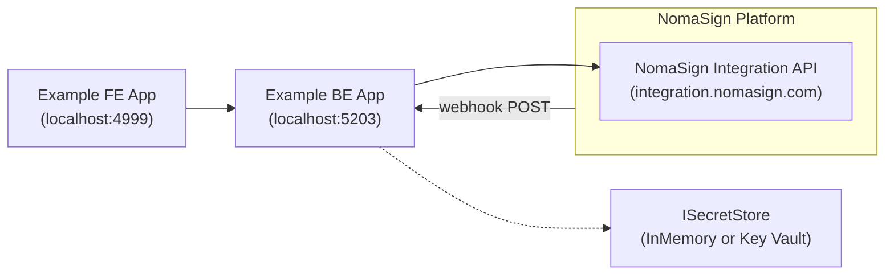

# .NET and React Integration Example

A full-stack example app that demonstrates sending documents for signature and receiving webhook notifications via the NomaSign Integration API.

## Prerequisites

You need a NomaSign integration account with a **Refresh Token** and **Webhook Secret**.

👉 **[Follow the integration setup guide on nomasign.com](https://www.nomasign.com/api/steps/)** to create your account and generate credentials.

You'll also need at least one **Signing Template** — go to **Templates** in the web app, create a template with at least one recipient placeholder and signature field.

## Technical Requirements

- .NET 8 SDK
- Node.js 18+
- [pnpm](https://pnpm.io/installation) — install with `npm install -g pnpm` or see [pnpm docs](https://pnpm.io/installation) for other methods

## Configuration

The backend reads its configuration from `Backend/appsettings.json`. The defaults point to the **production** Integration API — no changes needed unless targeting a different environment.

> **Refresh Token** and **Webhook Secret** are configured at runtime via the example app UI — no secrets in config files.
>
> You can also change the Integration API URL from the UI at runtime (useful for switching between environments).

## Running

### Backend

```bash
cd ".NET and React/Backend"
dotnet run
```

The API starts on `http://localhost:5203`. Swagger UI is available at `http://localhost:5203/swagger`.

### Frontend

```bash
cd ".NET and React/frontend"
pnpm install
pnpm dev
```

The UI starts on `http://localhost:4999`.

## Receiving Webhooks Locally

NomaSign needs to reach your backend to deliver webhook notifications. For local development, use **VS Code Dev Tunnels** (recommended):

```bash
# In VS Code: Ctrl+Shift+P → "Dev Tunnels: Create Tunnel"
# Or via CLI:
devtunnel create --allow-anonymous
devtunnel port create -p 5203
devtunnel host
```

Then set your tunnel URL + `/api/signing/webhooks/nomasign` as the webhook endpoint in the NomaSign Integration page.

> **Why VS Code Dev Tunnels?** They're free, built into VS Code, require no third-party signup, and support HTTPS by default. See [Microsoft Dev Tunnels docs](https://learn.microsoft.com/en-us/azure/developer/dev-tunnels/) for details.

## Architecture



The backend is organised by **domain**. Cross-cutting infrastructure sits at the root; everything signing-shaped lives under `Signing/`:

```
Backend/
├── Program.cs               # composition root
├── Infra/                   # cross-cutting, domain-agnostic (ISecretStore + impls)
└── Signing/                 # NomaSign signing domain
    ├── Clients/             # HTTP client to the NomaSign Integration API
    ├── Controllers/         # /api/signing/auth, /api/signing/config, /api/signing/templates, /api/signing/webhooks
    ├── Models/              # DTOs (IntegrationApiDtos, RequestDtos, ResponseDtos)
    └── Services/            # NomaSignService, WebhookService, RuntimeSettings
```

### Secrets

Two long-lived secrets live in `ISecretStore`:

| Key | Set by | Used for |
|---|---|---|
| `nomasign-refresh-token` | `POST /api/signing/config/refresh-token` | Exchanged for short-lived access tokens |
| `nomasign-webhook-secret` | `POST /api/signing/config/webhook-secret` | HMAC verification of inbound webhooks |

`ISecretStore` has two implementations selected at DI time: **`InMemorySecretStore`** (default — lost on restart, demo only) and **`KeyVaultSecretStore`** (used when `KeyVault:Url` is configured). The short-lived access token is cached in `NomaSignService` private fields — it expires in ~1 hour, so persisting it would be wasted work.

## What's demonstrated

1. **Authenticate** — store the refresh token, exchange it for an access token
2. **Send for signature** — map the demo DTO to the [Integration API payload](../docs/templates.md), using a template id copied from the web app
3. **Webhook notifications** — [HMAC-verify](../docs/webhooks.md) and parse inbound deliveries
