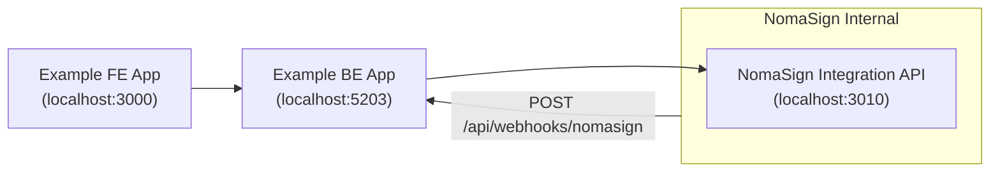

# Architecture

How the example app connects to NomaSign.

## What's Demonstrated

1. **Token Exchange** — Acquire an access token using a refresh token (`POST /connect/token`)
2. **List Templates** — Fetch available signing templates (`GET /api/templates`)
3. **Send for Signature** — Instantiate a template with real recipients (`POST /api/templates/{id}/send`)
4. **Webhook Receiver** — Receive and validate signed webhook notifications (HMAC-SHA256)
