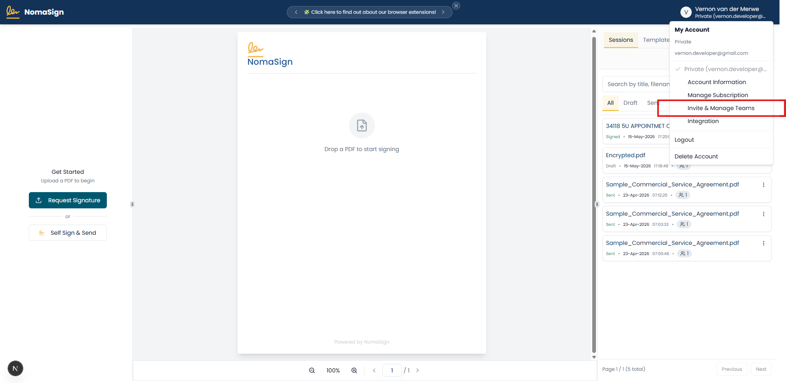
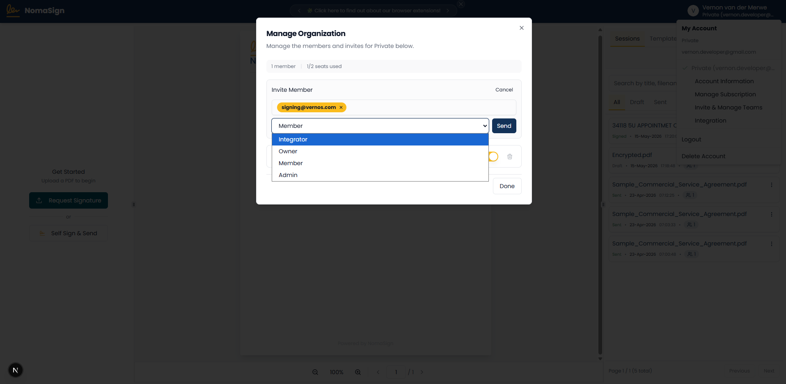
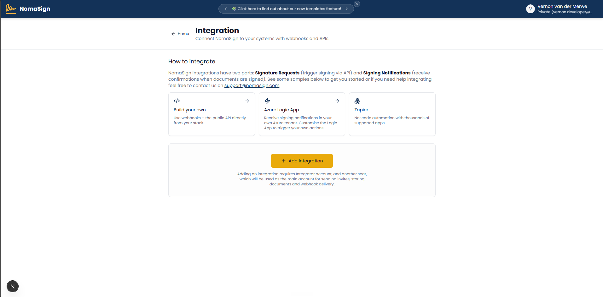

# Creating an Integration Account

You'll invite a dedicated email address as an **Integrator** in your organization. This account gets integration/API access automatically when assigned the Integrator role — no separate plan or subscription is needed for this account.

This will be an account like `sign@yourdomain.com` or `signme@yourdomain.com` — this is what signers will see as the sender after you've sent a document via the API.

> **Important:** The Integrator role is what grants API access. If you invite someone with a regular role (Member, Admin), they won't have integration access. Make sure you select **Integrator** in the invite dialog.

## Who performs this step?

You must be logged in as the **org owner** (the account that created the organization). Only org owners can invite members and assign the Integrator role. If you don't see the **Invite Member** button, you're likely not the org owner.

## About the integrator email

- **Must be a real, accessible inbox** — the invitation must be accepted from this mailbox.
- Shared mailboxes and aliases work, as long as they can receive email and complete account signup.
- Distribution lists that can't log in will **not** work.
- This email/display name is **visible to signers** as the sender of API-sent documents. Choose something professional and monitored (e.g. `signing@yourdomain.com`).
- In production, consider separate integrator accounts per environment: `nomasign-dev@`, `nomasign-staging@`, `nomasign-prod@`.

## Why a dedicated account?

Using a separate integrator account (instead of your personal admin account) gives you:

- **Least privilege** — the integrator can only do integration tasks, not admin operations.
- **Easier credential rotation** — revoke/regenerate without affecting human users.
- **Clear audit trail** — API actions are attributed to the integration, not a person.
- **Professional sender identity** — signers see a branded address, not an employee's email.

## Steps

### 1. Click on the Profile button

Log in at [app.nomasign.com](https://app.nomasign.com) **as the org owner** and click your profile image in the top-right corner.

### 2. Invite & Manage Teams

Select **Invite & Manage Teams** from the profile menu.

### 3. Invite Member

On the **Manage Organization** tab, click **Invite Member**.

### 4. Invite as Integrator

Enter your integrator email address (e.g. `signing@yourdomain.com`), set the role to **Integrator**, and send the invite.

### 5. Accept & Log In as Integrator

Accept the invitation email, then log in with the integrator account.

> **Browser tip:** Accept the invite in a **different browser** or **incognito/private window**. If you're already logged in as the org owner in the same browser, logging in as the integrator will sign you out of the owner session.

You'll see the **Integration** page after logging in.

## What the Integrator role can do

| Permission | Integrator | Member | Admin/Owner |
|---|:---:|:---:|:---:|
| Access Integration page | ✓ | ✗ | ✓ |
| Create/manage integration entries | ✓ | ✗ | ✓ |
| Generate refresh tokens & webhook secrets | ✓ | ✗ | ✓ |
| Create templates (own scope) | ✓ | ✓ | ✓ |
| Send templates via API | ✓ (own templates only) | ✗ | ✗ |
| Manage organization/billing | ✗ | ✗ | ✓ |
| Invite members | ✗ | ✗ | ✓ |

> **Stuck?** See the [FAQ](./faq.md) or [Troubleshooting](./troubleshooting.md) for invite issues, role questions, and session problems.

---

**Previous:** [← Creating a NomaSign Account](../step-1/index.md) | **Next:** [Creating a Signing Template →](../step-3/index.md)
