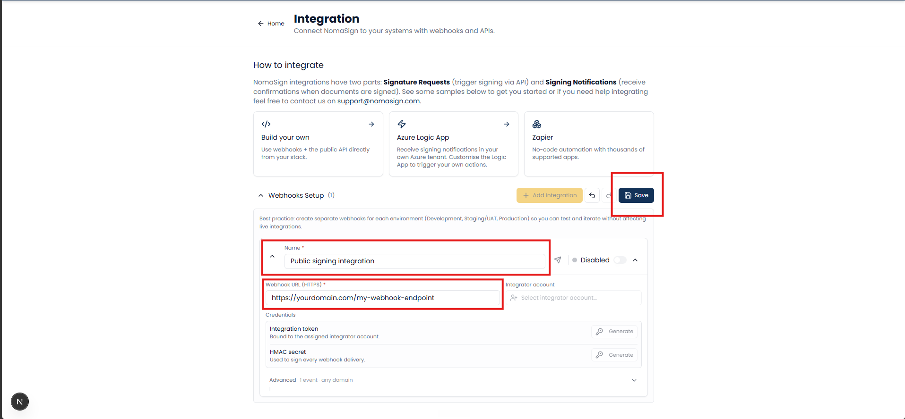
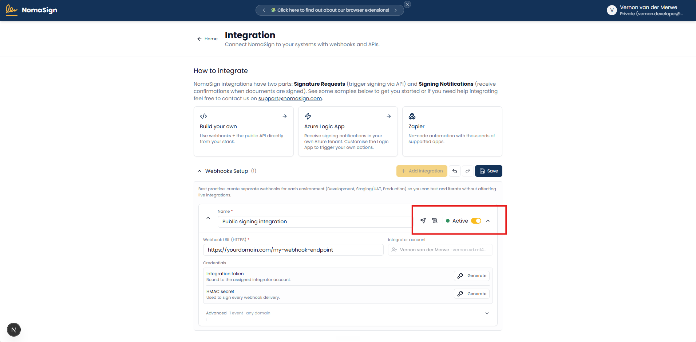
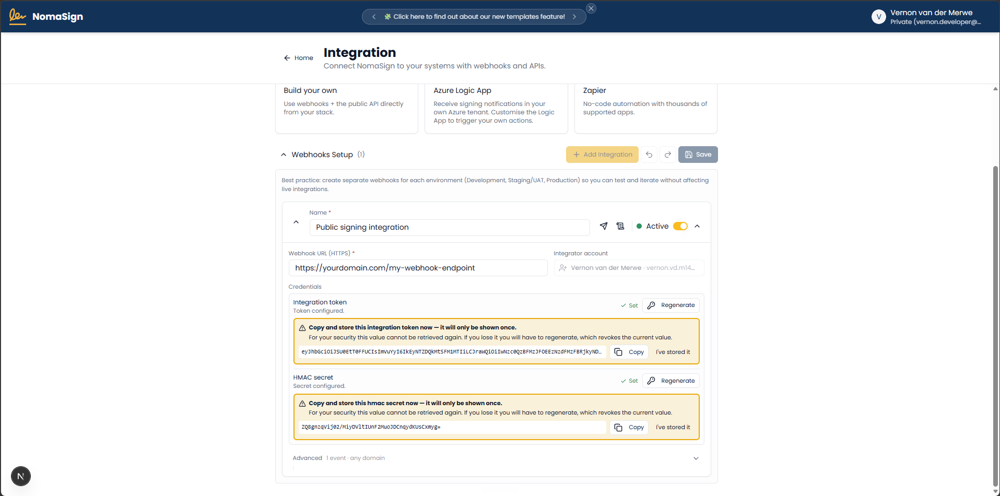

# Creating a Refresh Token & Webhook Secret

The final setup step is creating an **integration entry** and generating the credentials your application needs.

## What is an integration entry?

An integration entry represents one set of credentials (refresh token + webhook secret) for one environment or application. Think of it as a "connection" between your system and NomaSign.

- You can have **multiple integration entries** on the same integrator account — typically one each for development, staging, and production.
- Each entry has its own refresh token, webhook secret, and webhook URL.
- Deleting or deactivating an entry revokes **only that entry's** credentials. Other entries are unaffected.
- The webhook URL is **optional** — you can leave it blank if you only want to send documents and don't need event notifications yet.

## Steps

### 1. Add a New Integration

On the **Integration** page (logged in as the integrator), click **Add Integration**.

Fill in the fields:

| Field | What to enter | Example |
|---|---|---|
| **Name** | A human-readable name for this integration | `CRM Production` or `HR Dev` |
| **Webhook URL** | Your HTTPS endpoint for receiving events (optional) | `https://example.com/api/webhooks/nomasign` |

Save the entry.



> **Tip:** Use names that identify the environment: `Dev`, `Staging`, `Production`. This makes it easy to manage multiple entries later.

### 2. Activate the Integration

Activate your newly created integration to enable API access.



### 3. Generate Tokens

Click **Generate Tokens**. You'll receive:

- **Refresh Token** — used to obtain short-lived access tokens via `POST /connect/token`
- **Webhook Secret** — used to verify HMAC-SHA256 signatures on incoming webhook events



> ⚠️ **Copy both values immediately** — they're only shown once. If you lose them, you'll need to regenerate.

## Using your refresh token

The refresh token is exchanged for a short-lived access token. Here's the exact request:

```bash
curl -X POST "https://integration.nomasign.com/connect/token" \
  -H "Content-Type: application/x-www-form-urlencoded" \
  -d "grant_type=refresh_token" \
  -d "client_id=nomasign-integration" \
  -d "refresh_token=YOUR_REFRESH_TOKEN"
```

Response:

```json
{
  "access_token": "eyJhbG...",
  "expires_in": 3600,
  "token_type": "Bearer"
}
```

Use the `access_token` as a Bearer token for all subsequent API calls. It expires in ~1 hour — your backend should cache it and re-exchange when it expires.

## API base URL

| Environment | URL |
|---|---|
| **Production** | `https://integration.nomasign.com` |

There is no separate sandbox URL. All integration entries point to the same production API.

## What you'll use these for

| Credential | Purpose | Lifetime |
|---|---|---|
| **Refresh Token** | Exchanged for Access Tokens to authenticate API calls | Long-lived (months/years), revocable |
| **Access Token** | Bearer token for API requests | Short-lived (~1 hour) |
| **Webhook Secret** | Verifies HMAC-SHA256 signatures on incoming events | Stable until regenerated |

## Token lifecycle & rotation

- **Refresh tokens do not expire** on their own — they remain valid until you regenerate or deactivate the integration entry.
- **Regenerating** creates new credentials and **immediately invalidates** the previous refresh token and webhook secret for that entry.
- Update your deployed application immediately after rotating credentials.
- Access tokens minted with the old refresh token will continue to work until their natural expiry (~1 hour), but no new access tokens can be minted with the old refresh token.

## Security checklist

- [ ] Refresh token stored in a secrets manager (Azure Key Vault, AWS Secrets Manager, etc.) — never in source code
- [ ] Webhook secret stored alongside the refresh token in your secrets manager
- [ ] Neither value is exposed to frontend/client-side code
- [ ] Neither value is logged, emailed, or pasted into chat/tickets
- [ ] The example app UI is used only for local testing — production apps read from the secrets manager

> **The example app accepts secrets via the UI for demo purposes only.** In production, your backend should read them from a secrets manager at startup. See `Backend/Infra/ISecretStore.cs` for the abstraction pattern.

> **Stuck?** See the [FAQ](./faq.md) or [Troubleshooting](./troubleshooting.md) for token exchange errors, 401s, and credential rotation questions.

---

**Previous:** [← Creating a Signing Template](../step-3/index.md)

**Next:** [Receiving Webhook Notifications →](../step-5/index.md) *(optional — only needed if you want real-time event updates)*

**Done with setup?** Head back to the [main README](../../README.md) to run the example app.
