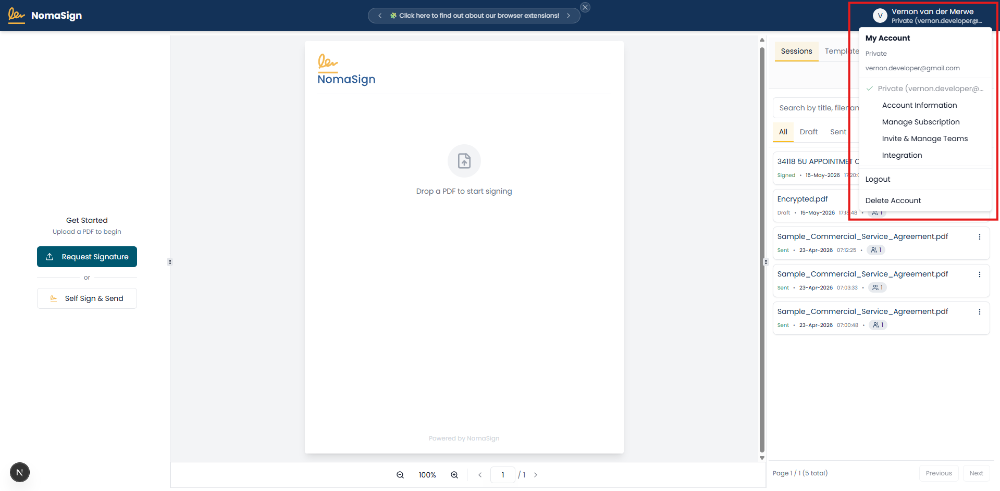
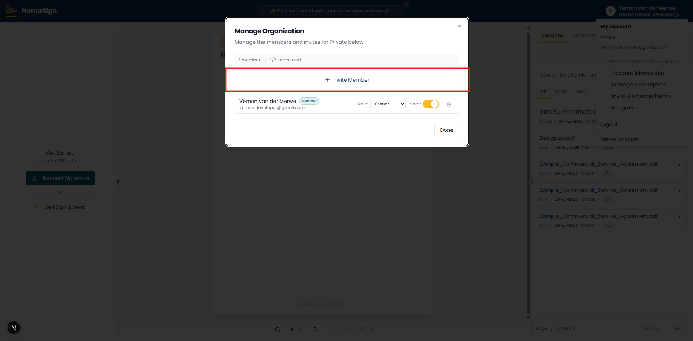

# Creating an Integration Account

You'll invite a dedicated email address as an **Integrator** in your organization. This is the sender identity that recipients will see when they receive documents from your integration.

This will be an account like `sign@yourdomain.com` or `signme@yourdomain.com` — this is what signers will see as the sender after you've sent a document via the API.

## Steps

### 1. Click on the Profile button

Log in at [app.nomasign.com](https://app.nomasign.com) and click your profile image in the top-right corner.

### 2. Invite & Manage Teams

Select **Invite & Manage Teams** from the profile menu.

### 3. Invite Member

On the **Manage Organization** tab, click **Invite Member**.

### 4. Invite as Integrator

Enter your integrator email address (e.g. `signing@yourdomain.com`), set the role to **Integrator**, and send the invite.

### 5. Accept & Log In as Integrator

Accept the invitation email, then log in with the integrator account. You'll see the **Integration** page.

---

**Previous:** [← Creating a NomaSign Account](./01-creating-a-nomasign-account.md) | **Next:** [Creating a Signing Template →](./03-creating-a-signing-template.md)
