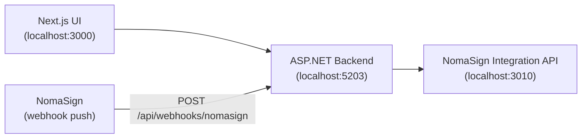

# NomaSign Integration Examples

A full-stack example showing how to integrate with the NomaSign signing platform using the Integration API.

## Architecture



## What's demonstrated

1. **Token Exchange** — Acquire an access token using a refresh token (`POST /connect/token`)
2. **List Templates** — Fetch available signing templates (`GET /api/templates`)
3. **Send for Signature** — Instantiate a template with real recipients (`POST /api/templates/{id}/send`)
4. **Webhook Receiver** — Receive and validate signed webhook notifications (HMAC-SHA256)

## Prerequisites

- .NET 8 SDK
- Node.js 18+
- pnpm
- A NomaSign account with:
  - A refresh token (generated via the Integration page in the web-app)
  - A webhook secret (configured in the webhook settings)
  - At least one signing template

## Setup

### 1. Configure the backend

Edit `.NET and React/Backend/appsettings.json`:

```json
{
  "NomaSign": {
    "BaseUrl": "http://localhost:3010",
    "ClientId": "nomasign-integration",
    "RefreshToken": "paste-your-refresh-token-here",
    "WebhookSecret": "paste-your-webhook-secret-here"
  }
}
```

### 2. Run the backend

```bash
cd ".NET and React/Backend"
dotnet run
```

The API will start on `http://localhost:5203`. Swagger UI is at `http://localhost:5203/swagger`.

### 3. Run the frontend

```bash
cd ".NET and React/frontend"
pnpm install
pnpm dev
```

The UI will start on `http://localhost:3000`.

### 4. Configure your webhook URL

In the NomaSign web-app Integration page, set your webhook endpoint to:

```
http://localhost:5203/api/webhooks/nomasign
```

> **Note:** For local development, you'll need a tunnel (e.g. dev tunnels, ngrok) so NomaSign can reach your localhost.

## Key files

| File | Purpose |
|------|---------|
| `.NET and React/Backend/Program.cs` | All API endpoints — token exchange, template proxy, webhook receiver |
| `.NET and React/frontend/src/app/integration-demo.tsx` | UI walking through the integration flow |
