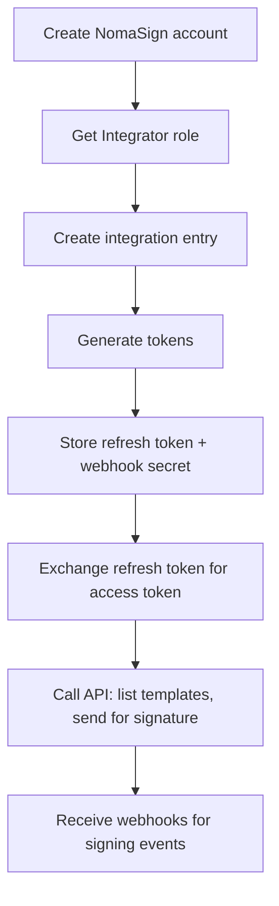

# NomaSign Integration — Documentation

Developer documentation for integrating with the NomaSign signing platform.

## Domains

| Domain | What it covers |
|--------|---------------|
| **[Accounts & Roles](accounts/index.md)** | NomaSign account setup, subscription plans, Integrator role, integration entries |
| **[Authentication](authentication/index.md)** | Refresh tokens, access tokens, the token exchange flow |
| **[Templates](templates/index.md)** | Creating templates, listing via API, sending for signature |
| **[Webhooks](webhooks/index.md)** | Receiving real-time notifications, HMAC signature verification |

Each domain folder contains:
- `index.md` — concept overview + implementation details
- `faq.md` — frequently asked questions
- `troubleshooting.md` — common problems and solutions

## Architecture

See [architecture/README.md](architecture/README.md) for the system diagram, backend layout, and secrets management.

## Quick-start flow

## Setup guide

For a step-by-step walkthrough of the initial setup, see the [Integration Setup](../Integration%20Setup/README.md) guide.
