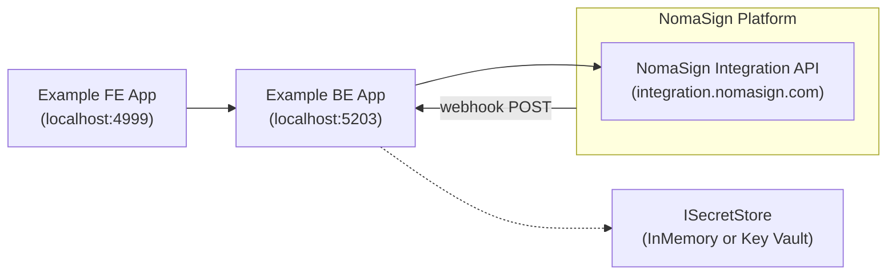

# Architecture

How the example app connects to NomaSign.



## Backend layout

The backend is organised by **domain**. Cross-cutting infrastructure sits at the root; everything signing-shaped lives under `Signing/`. New domains drop in alongside `Signing/` with the same internal structure.

```
Backend/
├── Program.cs               # composition root
├── Infra/                   # cross-cutting, domain-agnostic (ISecretStore + impls)
└── Signing/                 # NomaSign signing domain
    ├── Clients/             # HTTP client to the NomaSign Integration API
    ├── Controllers/         # /api/signing/auth, /api/signing/config, /api/signing/templates, /api/signing/webhooks
    ├── Models/              # DTOs (IntegrationApiDtos, RequestDtos, ResponseDtos)
    └── Services/            # NomaSignService, WebhookService, RuntimeSettings
```

Controllers never cross domain boundaries — each domain owns its config endpoints, services, and clients. HTTP routes are prefixed with `/api/<domain>/...` so namespacing is visible at the URL level too.

## Secrets

Two long-lived secrets live in `ISecretStore`:

| Key | Set by | Used in |
|---|---|---|
| `nomasign-refresh-token` | `POST /api/signing/config/refresh-token` | Step 1 — exchanged for short-lived access tokens |
| `nomasign-webhook-secret` | `POST /api/signing/config/webhook-secret` | Step 4 — HMAC verification of inbound webhooks |

`ISecretStore` has two implementations selected at DI time:

- **`InMemorySecretStore`** — default. Lost on restart, single-process. Demo only.
- **`KeyVaultSecretStore`** — used when `KeyVault:Url` is configured. Wraps `Azure.Security.KeyVault.Secrets.SecretClient` with `DefaultAzureCredential`, env-prefixed secret names, and soft-delete recovery.

The short-lived access token is held in `NomaSignService` private fields (not in `ISecretStore`) — it expires in ~1 hour, so persisting it would be wasted work.

## What's demonstrated

1. **[Authenticate](../process/step-1-authenticate.md)** — store refresh token, exchange for access token
2. **[List Templates](../process/step-2-list-templates.md)** — call the Integration API with the cached access token
3. **[Send for Signature](../process/step-3-send-for-signature.md)** — map demo DTO to the Integration API payload
4. **[Webhook Notifications](../process/step-4-webhook-notifications.md)** — HMAC-verify and parse inbound deliveries
