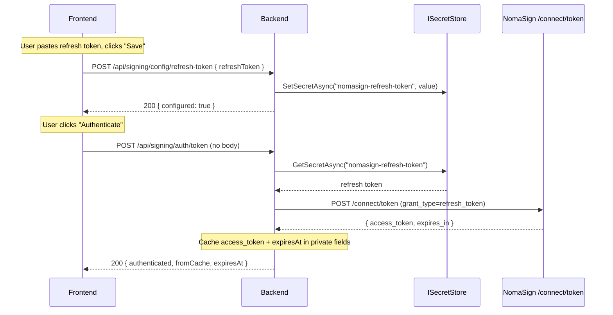

# Authentication

The NomaSign Integration API uses a two-token model: a long-lived **refresh token** and a short-lived **access token**.

## How it works

1. You generate a **refresh token** from the NomaSign Integration page (one-time setup).
2. Your backend exchanges that refresh token for a short-lived **access token** (~1 hour) via `POST /connect/token`.
3. The access token is used as a `Bearer` token on all subsequent API calls.
4. When the access token expires, your backend exchanges the refresh token again — no user interaction needed.

## Token exchange request

```bash
curl -X POST "https://integration.nomasign.com/connect/token" \
  -H "Content-Type: application/x-www-form-urlencoded" \
  -d "grant_type=refresh_token" \
  -d "client_id=nomasign-integration" \
  -d "refresh_token=YOUR_REFRESH_TOKEN"
```

**Response:**

```json
{
  "access_token": "eyJhbG...",
  "expires_in": 3600,
  "token_type": "Bearer"
}
```

## Token lifecycle

| Token | Lifetime | Storage |
|-------|----------|---------|
| **Refresh token** | Indefinite (until regenerated or deactivated) | Secrets manager (Key Vault, AWS Secrets Manager, etc.) |
| **Access token** | ~1 hour | Cached in memory on backend |

- Refresh tokens do **not** expire on their own.
- Regenerating creates a new token and **immediately invalidates** the previous one.
- Access tokens minted with the old refresh token continue to work until their natural expiry, but no new access tokens can be minted with the old refresh token.
- The `client_id` is always `nomasign-integration` — this is a fixed value.

## Security

- Refresh tokens must be stored in a secrets manager — never in source code, frontend code, or logs.
- Access tokens never leave the backend — the frontend does not see or handle them.
- Use the refresh token only when you need a new access token (on 401 or expiry) — don't regenerate credentials on every call.

## How the demo implements this



### Key implementation details

- The refresh token is stored in `ISecretStore` (in-memory for the demo, Key Vault in production).
- `ExchangeAsync` is guarded by a `SemaphoreSlim` — concurrent first-time callers don't all hit `/connect/token`.
- The access token never leaves the backend. The UI only receives `{ authenticated, fromCache, expiresAt }`.
- The cache TTL is the smaller of the token's nominal expiry (minus 60s buffer) and the JWT's `subscription_expires_at` claim.

### Code paths

| Layer | File |
|---|---|
| Save endpoint | `Backend/Signing/Controllers/ConfigController.cs` → `SetRefreshToken` |
| Persistence | `Backend/Infra/ISecretStore.cs` + `InMemorySecretStore.cs` / `KeyVaultSecretStore.cs` |
| Auth endpoint | `Backend/Signing/Controllers/AuthController.cs` → `Authenticate` |
| Orchestration | `Backend/Signing/Services/NomaSignService.cs` → `AuthenticateAsync` → `ExchangeAsync` |
| HTTP call | `Backend/Signing/Clients/NomaSignClient.cs` → `ExchangeTokenAsync` |
