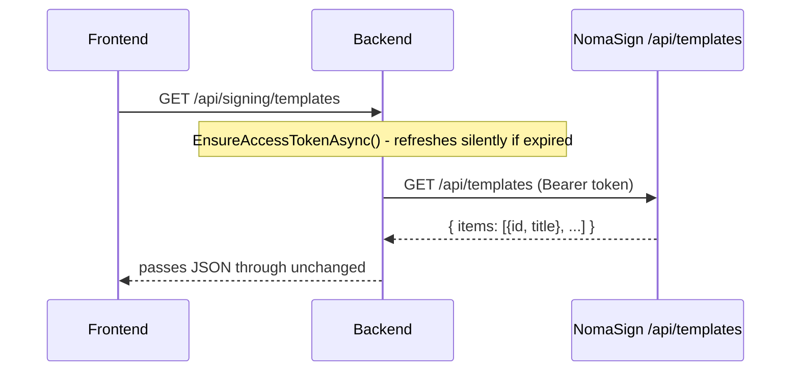

# Step 2 — List Templates

What happens when you click **Send** in the List Templates section.

## End-to-end flow

## What the backend does

1. `TemplatesController.GetTemplates` calls `NomaSignService.GetTemplatesAsync`.
2. `EnsureAccessTokenAsync` checks the cached access token. If it's missing or past `_accessExpiresAt`, it triggers a refresh by reading the stored refresh token from `ISecretStore` and calling `/connect/token` (same path as Step 1's exchange).
3. `NomaSignClient.GetTemplatesAsync` sets the `Authorization: Bearer <token>` header and calls the Integration API.
4. The JSON response is returned to the UI verbatim — there's no DTO mapping for templates.

## Code paths

| Layer | File |
|---|---|
| Endpoint | `Backend/Signing/Controllers/TemplatesController.cs` → `GetTemplates` |
| Orchestration | `Backend/Signing/Services/NomaSignService.cs` → `GetTemplatesAsync` + `EnsureAccessTokenAsync` |
| HTTP call | `Backend/Signing/Clients/NomaSignClient.cs` → `GetTemplatesAsync` |

## Notes

- The access token is added by the backend, not the browser. The frontend doesn't see it and doesn't include any auth header in its request to `/api/signing/templates`.
- Because `EnsureAccessTokenAsync` auto-refreshes, you can hit this endpoint long after Step 1 — the backend will silently mint a new access token from the stored refresh token if needed.
