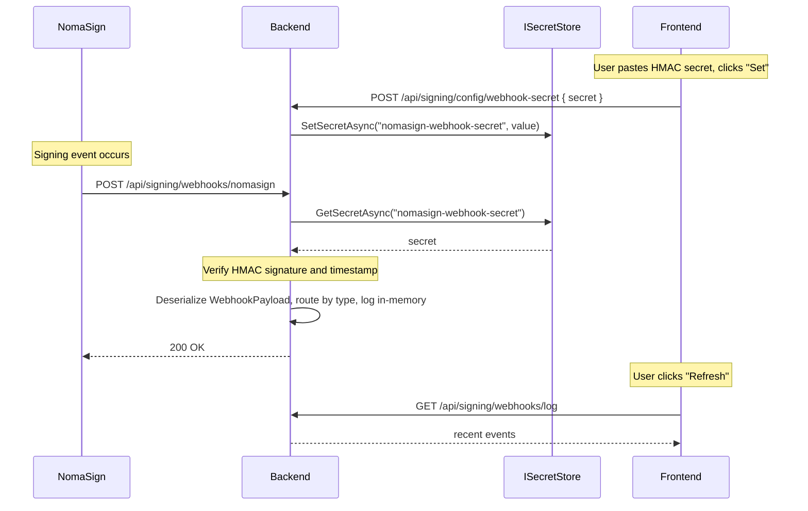

# Step 4 — Webhook Notifications

What happens when NomaSign delivers a webhook to your backend.

## End-to-end flow

## Signature verification

The `X-NomaSign-Signature` header follows the format `t=<unix_timestamp>,v1=<hex_hmac>`. Verification (in `WebhookService.VerifySignature`):

1. **Parse** the header into `t` and `v1` parts.
2. **Freshness check** — reject if `|now - t| > 300` seconds. Without this, captured `(body, signature)` pairs replay forever.
3. **Recompute** `HMAC-SHA256("{t}.{rawBody}", secret)` and hex-encode it.
4. **Constant-time compare** the recomputed digest against `v1` using `CryptographicOperations.FixedTimeEquals` — prevents timing attacks on the comparison.

If any check fails, the controller returns `401` and the payload is dropped.

## Reading the raw body

`WebhooksController.Receive` reads the request body as raw bytes **before** model binding consumes it. The signature is computed over the exact bytes NomaSign sent, so any reformatting (whitespace, key reordering) by `[FromBody]` deserialization would break HMAC equality.

## Code paths

| Layer | File |
|---|---|
| Save endpoint | `Backend/Signing/Controllers/ConfigController.cs` → `SetWebhookSecret` |
| Persistence | `Backend/Infra/ISecretStore.cs` (same store as the refresh token, different key) |
| Receive endpoint | `Backend/Signing/Controllers/WebhooksController.cs` → `Receive` |
| Verify + parse | `Backend/Signing/Services/WebhookService.cs` → `VerifyAndParseAsync` + `VerifySignature` |
| Wire DTOs | `Backend/Signing/Models/IntegrationApiDtos.cs` → `WebhookPayload`, `WebhookSession`, `WebhookRecipient`, `WebhookDocument`, `WebhookField` |

## Notes

- Webhook deliveries arrive on the public-facing route — make sure your backend is reachable. For local development, use [VS Code Dev Tunnels](https://learn.microsoft.com/en-us/azure/developer/dev-tunnels/) (free, HTTPS, no third-party signup).
- The example logs events into a process-local list (`_eventLog`) capped at 100 entries. A real integration would publish to a queue or persist to a database.
- Idempotency: use the payload's `id` field to dedupe — NomaSign sends the same `id` for retried deliveries of the same event.
- For payload field reference, see `Backend/Signing/Models/IntegrationApiDtos.cs` (the deserialized records are the source of truth).
