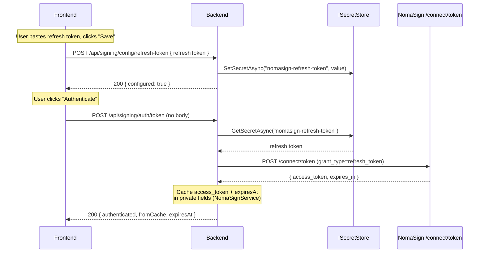

# Step 1 — Authenticate

What happens when you save a refresh token and click **Authenticate** in the demo UI.

## End-to-end flow

## Why two steps?

The **refresh token** is long-lived (months/years). The **access token** it mints is short-lived (~1 hour). In production:

- The refresh token is provisioned to your secret store once at integration setup — not via UI.
- Access tokens are minted on demand and cached in memory until they expire.

The demo keeps both flows visible (the save call + the exchange call) so the lifecycle is obvious.

## Code paths

| Layer | File |
|---|---|
| Save endpoint | `Backend/Signing/Controllers/ConfigController.cs` → `SetRefreshToken` |
| Persistence | `Backend/Infra/ISecretStore.cs` + `InMemorySecretStore.cs` / `KeyVaultSecretStore.cs` |
| Auth endpoint | `Backend/Signing/Controllers/AuthController.cs` → `Authenticate` |
| Orchestration | `Backend/Signing/Services/NomaSignService.cs` → `AuthenticateAsync` → `ExchangeAsync` |
| HTTP call | `Backend/Signing/Clients/NomaSignClient.cs` → `ExchangeTokenAsync` |

## Notes

- `ExchangeAsync` is guarded by a `SemaphoreSlim`. Concurrent first-time callers don't all hammer `/connect/token` — the first one mints, the rest read the cached result.
- The access token never leaves the backend. `AuthenticateResponse` returns only `{ authenticated, fromCache, expiresAt }`.
- The cache TTL is the smaller of the token's nominal expiry (minus a 60-second safety buffer) and the JWT's `subscription_expires_at` claim — so cancellation/lapse on the NomaSign side evicts our cached token without waiting for `expires_in` to elapse.
