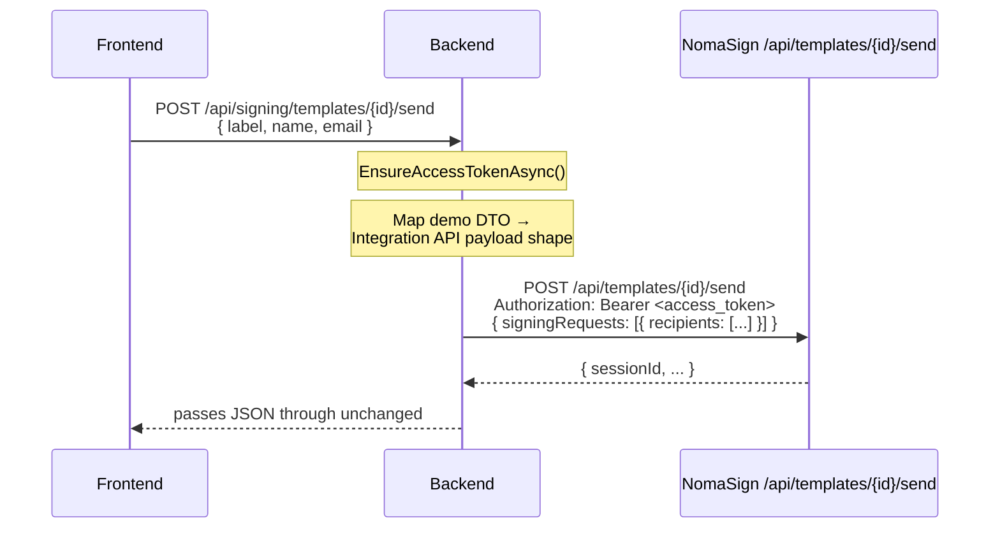

# Step 3 — Send for Signature

What happens when you fill in a recipient and click **Send** in the Send for Signature section.

## End-to-end flow



## DTO mapping

The frontend sends a flat request:

```json
{ "label": "Signer 1", "name": "Jane Doe", "email": "jane@example.com" }
```

`NomaSignService.SendTemplateAsync` wraps that into the shape the Integration API expects:

```json
{
  "signingRequests": [
    {
      "recipients": [
        { "label": "Signer 1", "name": "Jane Doe", "email": "jane@example.com" }
      ],
      "fields": []
    }
  ],
  "sendInitialNotification": true
}
```

This mapping lives in one place — `NomaSignService.SendTemplateAsync` — so the demo's simple form stays decoupled from the Integration API's nested structure.

## Code paths

| Layer | File |
|---|---|
| Endpoint | `Backend/Signing/Controllers/TemplatesController.cs` → `SendTemplate` |
| Mapping | `Backend/Signing/Services/NomaSignService.cs` → `SendTemplateAsync` |
| Wire DTOs | `Backend/Signing/Models/IntegrationApiDtos.cs` → `IntegrationSendPayload`, `IntegrationSigningRequest`, `IntegrationRecipient` |
| HTTP call | `Backend/Signing/Clients/NomaSignClient.cs` → `SendTemplateAsync` |

## Notes

- The demo sends one recipient. Real integrations can pass multiple recipients per signing request, and multiple signing requests per call.
- `fields` is left empty in the demo — that's where you'd pre-fill template fields (e.g. populate "Full Name" so the signer doesn't have to type it).
- `sendInitialNotification: true` makes NomaSign email the recipient. Set to `false` if you want to deliver the signing link yourself.
