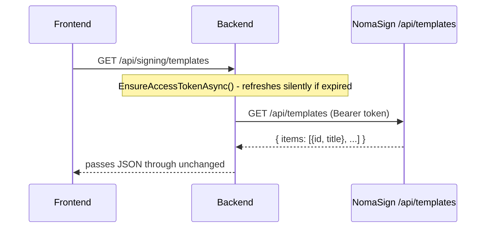
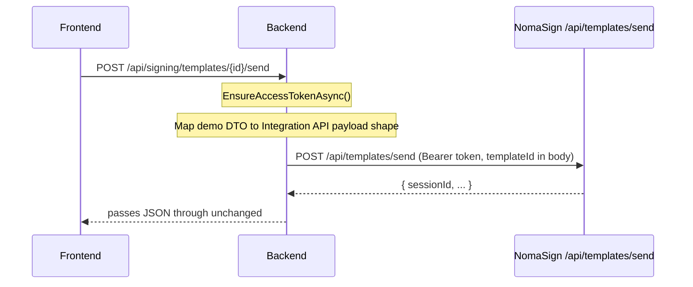

# Templates

Templates are reusable document structures. Think of an employment contract — the structure stays the same, but you swap out the name, the date, and who's signing each time. Your integration instantiates a template via the API, filling in recipients and field values.

## Key concepts

### Template scope

Templates are **user-scoped**. The Integration API can only access templates created by the integrator account. Templates created by other users (admins, members) in your organization are not visible to the API.

### Recipient placeholders

A recipient placeholder is a named slot in the template that gets filled with a real person when you send via API. The placeholder label (e.g. `Signer 1`) is what your API payload uses to map a real name/email to that slot.

> **Placeholder labels are case-sensitive.** If your template says `Signer 1`, your API payload must use `"label": "Signer 1"` exactly.

### Pre-fillable fields

Any text fields you add to the template can be pre-filled by the API using their label. Give each field a clear, stable, developer-friendly name:

| Good names | Bad names |
|---|---|
| `customer_name` | `Text 1` |
| `contract_start_date` | `Field 2` |
| `salary_amount` | `Input` |

## Listing templates

```
GET /api/templates
Authorization: Bearer <access_token>
```

Returns all templates owned by the authenticated integrator account.

## Sending a template

```
POST /api/templates/send
Authorization: Bearer <access_token>
Content-Type: application/json
```

```json
{
  "templateId": "your-template-id",
  "signingRequests": [{
    "recipients": [{
      "label": "Signer 1",
      "name": "Jane Smith",
      "email": "jane@example.com"
    }],
    "fields": [
      { "label": "customer_name", "recipient": "Signer 1", "value": "Jane Smith" },
      { "label": "contract_start_date", "recipient": "Signer 1", "value": "2026-06-01" }
    ]
  }],
  "sendInitialNotification": true
}
```

### Required fields

| Field | Description |
|-------|-------------|
| `templateId` | The template to instantiate |
| `signingRequests` | Array of signing request objects (at least one) |

### Optional fields

| Field | Default | Description |
|-------|---------|-------------|
| `signingType` | Template default | `"parallel"` or `"sequential"` |
| `authRequirement` | Template default | `"public"` or `"otp"` (OTP requires email verification before signing) |
| `senderName` | Authenticated user's name | Display name on the invite email |
| `subject` | `null` | Custom email subject line |
| `message` | `null` | Custom message body in the invite email |
| `messageTemplate` | `null` | Message template with placeholders |
| `cc` | `[]` | Array of email addresses to CC on all notifications |
| `replyToEmail` | `null` | Reply-to address on invite emails |
| `sendInitialNotification` | `true` | Whether NomaSign emails the recipient. Set to `false` to deliver the signing link yourself |
| `remindersEnabled` | `null` | Enable/disable automatic reminder emails |
| `reminderDaysBeforeExpiry` | `null` | Array of days before expiry to send reminders (e.g. `[7, 3, 1]`) |
| `expiresInDays` | `30` | Number of days before the signing session expires |

- You can pass multiple recipients per signing request, and multiple signing requests per call.
- `fields` is optional — omit it if you don't need to pre-fill any values.

## Finding a template ID

- **URL bar** — when viewing the template in the NomaSign web app, the ID is in the URL
- **API** — call `GET /api/templates` and look at the `id` field in the response

## Template checklist (before going live)

- [ ] Every signer has at least one required signature field
- [ ] All API-filled fields have clear, stable names
- [ ] Recipient placeholder labels are final (changing them breaks API calls)
- [ ] You've tested the template manually in the UI at least once
- [ ] The template was created by the integrator account

> **Warning:** Renaming recipient placeholders or field labels after going live will break existing API integrations. Treat production templates like versioned contracts — clone before making changes.

## How the demo implements this

### Listing templates



### Sending for signature



The frontend sends a flat request:

```json
{ "label": "Signer 1", "name": "Jane Doe", "email": "jane@example.com" }
```

`NomaSignService.SendTemplateAsync` wraps it into the nested `signingRequests` shape the Integration API expects, adding `templateId` to the body.

### Code paths

| Layer | File |
|---|---|
| List endpoint | `Backend/Signing/Controllers/TemplatesController.cs` → `List` |
| Send endpoint | `Backend/Signing/Controllers/TemplatesController.cs` → `Send` |
| Orchestration | `Backend/Signing/Services/NomaSignService.cs` → `GetTemplatesAsync` / `SendTemplateAsync` |
| DTO mapping | `Backend/Signing/Models/IntegrationApiDtos.cs` |
| HTTP calls | `Backend/Signing/Clients/NomaSignClient.cs` → `GetTemplatesAsync` / `SendTemplateAsync` |
