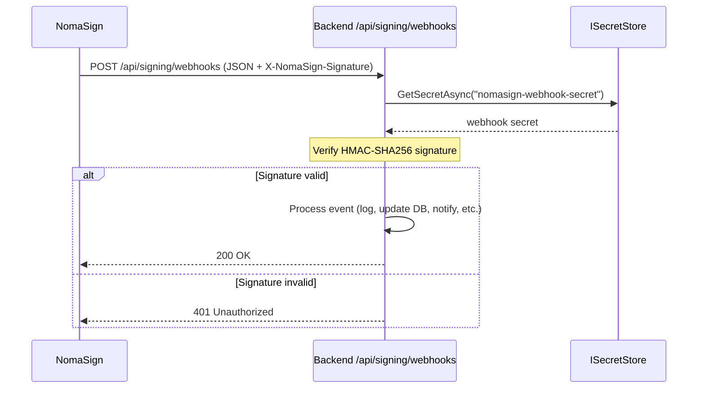

# Webhooks

Webhooks let NomaSign push real-time notifications to your backend when signing events happen — document signed, declined, expired, etc.

## How it works

1. You configure a **webhook URL** and receive a **webhook secret** in your integration entry.
2. When an event occurs, NomaSign sends a `POST` to your URL with a JSON payload.
3. Your backend **verifies the HMAC-SHA256 signature** before processing the event.
4. You respond with `200 OK` within a reasonable time window.

## Setting up webhooks

In your integration entry on NomaSign:
1. Enter your **Webhook Callback URL** — must be HTTPS and publicly reachable.
2. Copy the **Webhook Secret** — this is shown once at generation time.
3. Store the secret in your secrets manager alongside your refresh token.

## Payload structure

```http
POST /your-webhook-endpoint HTTP/1.1
Content-Type: application/json
X-NomaSign-Signature: t=1719849600,v1=5257a869e7ecebeda32affa62cdca3fa51cad7e77a0e56ff536d0ce8e108d8bd
```

```json
{
  "eventType": "document.signed",
  "timestamp": "2026-07-01T12:00:00Z",
  "data": {
    "sessionId": "abc-123",
    "templateId": "template-456",
    "signerEmail": "jane@example.com"
  }
}
```

## Signature verification (HMAC-SHA256)

The signature header follows a Stripe-style format:

```
X-NomaSign-Signature: t=<unix_timestamp>,v1=<hex_hmac>
```

**Verification steps:**

1. Extract `t` (timestamp) and `v1` (signature) from the header.
2. Construct the signed payload: `{t}.{raw_request_body}` (timestamp + dot + body).
3. Compute HMAC-SHA256 of that string using your webhook secret as the key.
4. Compare your computed signature with `v1` using a **timing-safe comparison**.
5. Optionally reject if `t` is too far in the past (replay protection — recommended: 5 minutes).

### C# example

```csharp
public static bool VerifySignature(string header, string body, string secret)
{
    var parts = header.Split(',')
        .Select(p => p.Split('=', 2))
        .ToDictionary(p => p[0], p => p[1]);

    var timestamp = parts["t"];
    var signature = parts["v1"];

    var signedPayload = $"{timestamp}.{body}";
    using var hmac = new HMACSHA256(Encoding.UTF8.GetBytes(secret));
    var computed = Convert.ToHexString(
        hmac.ComputeHash(Encoding.UTF8.GetBytes(signedPayload))
    ).ToLowerInvariant();

    return CryptographicOperations.FixedTimeEquals(
        Encoding.UTF8.GetBytes(computed),
        Encoding.UTF8.GetBytes(signature)
    );
}
```

## Event types

| Event | Description |
|-------|-------------|
| `document.signed` | All recipients have completed signing |
| `document.declined` | A recipient declined to sign |
| `document.expired` | The signing session expired without completion |
| `document.viewed` | A recipient opened the signing link |

## Retry behavior

- If your endpoint doesn't respond `2xx`, NomaSign retries with exponential backoff.
- After exhausting retries, the event is dropped — design your system to handle missed events gracefully.
- Your endpoint should be **idempotent** — the same event may be delivered more than once.

## Security requirements

- **Always verify the signature** before processing. Never trust the payload without verification.
- **Use HTTPS** — webhook URLs must be TLS-encrypted.
- **Reject replays** — check the timestamp `t` against the current time; reject if too old.
- **Don't leak the secret** — treat it like a password.

## How the demo implements this



### Code paths

| Layer | File |
|---|---|
| Webhook endpoint | `Backend/Signing/Controllers/WebhooksController.cs` → `Receive` |
| Signature verification | `Backend/Signing/Services/WebhookVerificationService.cs` |
| Secret retrieval | `Backend/Infra/ISecretStore.cs` → `GetSecretAsync("nomasign-webhook-secret")` |
| Config endpoint | `Backend/Signing/Controllers/ConfigController.cs` → `SetWebhookSecret` |
